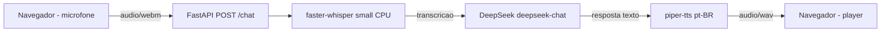
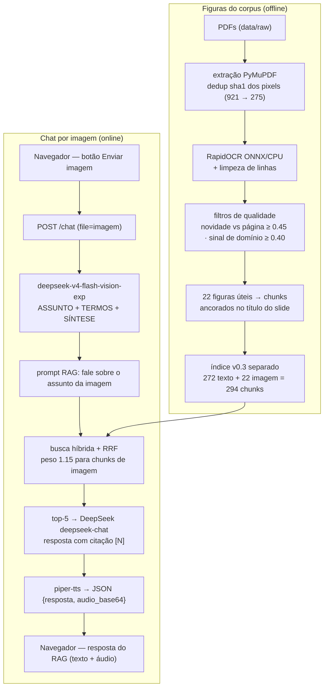
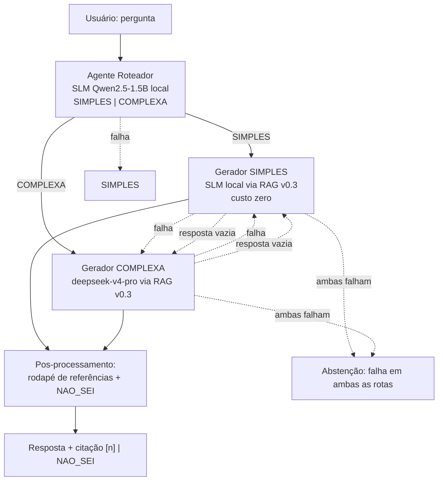
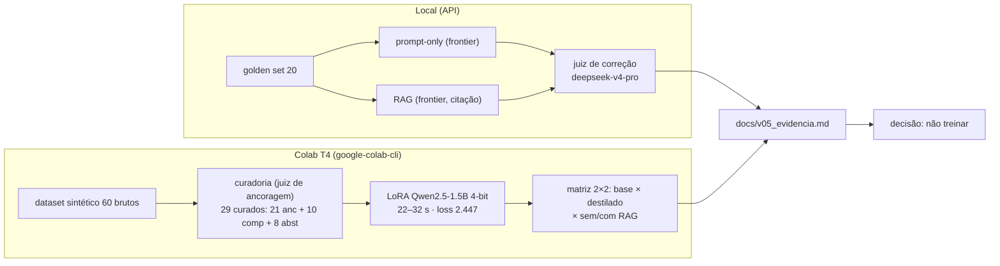
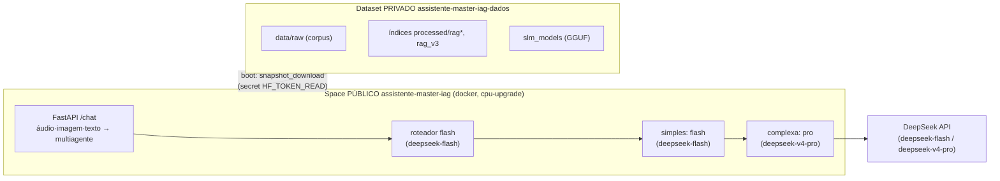

# Projeto Final — Assistente Generativo sobre Materiais do Master IAG & LLM (PUC-Rio)

> **Disciplina:** PROJ · Master IAG & LLM 2025-2 (PUC-Rio)
> **Status:** v1.0 · Produção ✅ **CONCLUÍDA** — Space público [`assistente-master-iag`](https://huggingface.co/spaces/rafaelang/assistente-master-iag) (URL pública funcionando, docker/cpu-upgrade) + corpus privado em dataset separado; custo por mil consultas **US$ 0,27** (cascade) / US$ 1,50 (pro forçado); docs/v10.md + v10_evidencia.md. Roadmap v0.1→v1.0 fechado (v0.1 voz → v0.6 avaliação → v1.0 produção).
> **Repositório base de consulta:** `projeto2/` (protótipo de experimentação)

**Proposta em uma frase:** assistente generativo que responde dúvidas sobre o conteúdo do curso Master IAG & LLM (PUC-Rio), com voz, leitura de imagens, roteamento simples/complexo entre SLM local e LLM remoto, e resposta sempre citando a fonte do material — abstendo-se quando a pergunta está fora do corpus.

---

## Resumo executivo

Assistente **multimodal** (voz → texto → RAG → resposta citada → áudio), evoluído
em quatro releases com **decisões medidas e arquitetura leve** (etapas locais
ONNX/CPU + LLM remoto DeepSeek + SLM local):

- **v0.1 · Voz** — decisão: ASR local (`faster-whisper small`) com **vocabulário
  de domínio** como prompt-guia e TTS local (Piper). Resultado: WER médio
  **0.2290 → 0.0863** (10 audios do próprio aluno).
- **v0.2 · RAG** — decisões: ingestão **anti-garbage** (remove e-mails/URLs/
  mobilia de slides), chunking por parágrafos com **overlay** e filtro micro,
  **BM25 próprio pt-BR + fastembed + RRF ponderado** (rerank cross-encoder
  testado e **desativado** — piorava MRR). Resultado: recall@5 **1.000** /
  MRR **0.969**; end-to-end **acurácia 0.700** (14/20) e abstenção indevida
  **0.250** com `deepseek-chat`.
- **v0.3 · Imagem** — decisões: **OCR local (RapidOCR/ONNX)** em vez de VLM
  remoto para as figuras do corpus (dedup por sha1: 921 → 275 únicas, **22
  figuras úteis** indexadas após filtros de novidade/sinal de domínio), índice
  **texto+imagem separado** (272 → 294 chunks) com peso 1.15 para figuras no
  RRF; e **visão multimodal** (`deepseek-v4-flash-vision-exp`) no chat por
  imagem, que extrai ASSUNTO/TERMOS e pergunta ao RAG *"fale sobre"*. Resultado:
  conteúdo da figura no top-5 **0.000 → 1.000** e **3/3** casos em que a visão
  corrigiu o texto (o RAG só-texto abstinha-se com `NAO_SEI`).
- **v0.4 · Agentes** — decisões: **SLM local de verdade** (Qwen2.5-1.5B-Instruct
  GGUF Q4_K_M via llama-cpp-python, 100% CPU, US$ 0.00) na rota simples, LLM
  remoto (`deepseek-v4-pro`) na rota complexa, **roteador SIMPLES/COMPLEXA** com
  **fallback cruzado sob falha** (falha/rota → outra rota; ambas falham →
  abstenção com motivo) e **estudo de roteadores**: default passou a
  **`cascade`** (R2 TF-IDF+XGB decide ~85% a <2 ms/US$ 0; `INDETERMINADO` → R1
  SLM few-shot; θ=0.60). Medição R1 (SLM): abstenção correta **0.950** (19/20);
  com o default `cascade` o golden set mede **0.850** (decisão por custo,
  detalhes em `docs/v04.md` §11). API: **um único `/chat`** (áudio, imagem ou
  texto) roda o fluxo multiagente por padrão (`AGENTES_HABILITADO=true`);
  todas as entradas passam pelo mesmo RAG/resposta e a saída é JSON
  `{texto, resposta, audio_base64}` — WAV só para entradas de áudio/imagem.

Cada release fecha com **evidência medida** em `docs/` (`v0X.md` +
`v0X_evidencia.md`), testes `pytest` e tag no Git.

- **v0.5 · Adaptação** — comparativo prompt/RAG/fine-tuning/pré-treino com
  decisão **"não treinar"** (o destilado LoRA piora acurácia por super-cautela,
  `docs/v05.md`). v0.5b expande o corpus para 193 docs / 3.401 chunks e o
  golden para 44Q (`docs/v05b.md`).
- **v0.6 · Avaliação** — avaliação **por estrato** com golden 132Q
  (roteadora 0.609 → composta 0.586 → negativa 0.125 → adversarial 0.833);
  regra determinística V5 resgata a negativa (2/16 → 11/14); régua
  doc (0.659) × página (0.605) mostra a página como limitante; TCO
  0.00027/Q (`docs/v06.md` + `v06_evidencia.md`).
- **v1.0 · Produção** — deploy em **Space público** + **dataset privado**
  (corpus fora do repo), custo por mil consultas, e três defeitos de produção
  corrigidos no smoke test (nomes de modelo obsoletos, SIGPIPE no boot,
  timeout de LLM) — ver §Arquitetura da v1.0 e `docs/v10.md`.

---

## 1. Objetivo

Construir, **do zero e de forma incremental**, um assistente generativo completo sobre os materiais didáticos do próprio curso. O projeto segue o roadmap oficial da disciplina (v0.1 → v1.0) e cada release é reimplementada, testada manualmente e aprovada antes de avançar para a próxima.

Os objetivos de aprendizado são:

- Implementar um pipeline generativo ponta a ponta: voz → texto → raciocínio → resposta + citação.
- Medir o desempenho de cada etapa com métricas objetivas (WER, recall@k, taxa de abstenção, etc.).
- Experimentar arquiteturas heterogêneas (SLM local + LLM remoto, agentes, RAG multimodal).
- Documentar decisões técnicas e evidências em `docs/`.
- Publicar uma URL pública funcional na v1.0, com estimativa de custo por mil consultas.

---

## 2. Escolha do Tema / Domínio

**Domínio:** materiais didáticos do Master IAG & LLM (PUC-Rio) — ementas, PDFs de aulas, slides e notebooks.

**Por que este domínio atende à especificação:**

- **Corpus acessível e controlado:** os PDFs e slides das disciplinas já estão disponíveis localmente, sem depender de dados de terceiros.
- **Delimitado e mensurável:** perguntas fora do conteúdo do curso são naturalmente identificáveis, facilitando a abstenção correta.
- **Sem PII sensível:** ementas e slides didáticos não carregam dados pessoais (cuidado com fotos ou dados pessoais que eventualmente apareçam — devem ser anonimizados).
- **Cobre todas as releases do roadmap:** voz (aulas gravadas), RAG (PDFs), imagem (slides/figuras), agentes (roteamento de dúvidas), adaptação, avaliação e produção.

> **Corpus inicial (10 documentos):** será montado na preparação inicial (v0.0) em `data/raw/`. Exemplos de documentos: ementas, slides de TDP, NLP, PAI, DPIA, DGL e aulas do próprio projeto.

---

## 3. Especificações por Release

O projeto segue a especificação oficial da disciplina. Cada release adiciona uma capacidade e fecha com evidência medida.

| Release | Capacidade | Entrega esperada | Métrica / evidência |
|---|---|---|---|
| **v0.0** | Fundação | Estrutura de pastas, README, contrato de agentes, `.gitignore`, corpus de 10 docs, ambiente `uv` funcionando. | Repo inicializado, build limpo. |
| **v0.1** | Voz | Protótipo de voz funcional; transcrição com e sem vocabulário de domínio. | WER em 10 amostras próprias, antes/depois do vocabulário. |
| **v0.2** | RAG | Pipeline RAG que responde citando fonte e se abstém fora do corpus. | recall@k + taxa de abstenção correta em golden set. |
| **v0.3** | Imagem | Analisador de imagens integrado ao RAG. | 1 caso documentado em que a visão corrigiu o texto. |
| **v0.4** | Agentes | Fluxo heterogêneo (roteador + modelos distintos), diagrama de chamadas. | Comportamento sob falha documentado + teste. |
| **v0.5** | Adaptação | Tabela comparativa: prompt / RAG / fine-tuning (LoRA) / pré-treino. | Decisão justificada e, se possível, medição. |
| **v0.6** | Avaliação | Relatório de avaliação estratificada. | Desempenho por estrato + 1 falha encontrada pelo aluno. |
| **v1.0** | Produção | URL pública funcionando + README de arquitetura. | Custo por mil consultas estimado. |

Regras de controle:

- Uma release por aula; nunca quebrar uma release já aprovada.
- Cada release fecha com evidência medida registrada em `docs/vXX_*.md`.
- Dependências são adicionadas por release, sem bloat.
- Nunca subir PDFs brutos, `.env`, `.venv` ou caches no Git.

---

## 4. Instruções

### 4.1 Preparação do ambiente

```bash
cd projeto_final

# O projeto já foi inicializado com uv. Crie/ative o ambiente virtual:
uv venv
source .venv/bin/activate

# Sincronize as dependências (inicialmente vazias; por release use uv add):
uv sync
```

### 4.2 Como acompanhar o desenvolvimento release a release

1. **Leia o contrato** em `AGENTS.md` (a ser criado na v0.0).
2. **Verifique o escopo** da próxima release neste README e na spec.
3. **Implemente** a release com testes em `tests/`.
4. **Rode a suite:**
   ```bash
   pytest
   ```
5. **Meça a evidência** e registre em `docs/vXX_*.md`.
6. **Teste manualmente** e peça aprovação ao usuário.
7. **Só então** avance para a próxima release.

### 4.3 Estrutura de pastas

```
projeto_final/
├── README.md            ← este arquivo
├── AGENTS.md            ← contrato permanente para agentes (v0.0)
├── .gitignore
├── pyproject.toml
├── .python-version
├── data/
│   ├── raw/             ← corpus (fora do Git)
│   ├── processed/       ← chunks, índices, modelos (fora do Git)
│   └── golden_set/      ← avaliação reprodutível (no Git)
├── src/
│   └── projeto_final/   ← pacote Python gerado pelo uv
├── tests/               ← testes por release
├── prompts/             ← templates de prompt versionados
└── docs/                ← specs, evidências e relatórios
```

### 4.4 Variáveis de ambiente

Crie um arquivo `.env` (não versionado) para chaves de API:

```bash
DEEPSEEK_API_KEY=sk-...
```

Nunca commitar `.env`.

---

## 5. Arquitetura da v0.1

O prototipo v0.1 segue o pipeline **ASR -&gt; LLM -&gt; TTS**, servido por uma pagina HTML estatica via FastAPI:



Componentes:

- **Entrada:** pagina HTML em `static/index.html` grava audio do microfone e envia via multipart para `/chat`.
- **ASR:** `faster-whisper` small roda 100% em CPU, com vocabulario de dominio como `initial_prompt`.
- **LLM:** DeepSeek `deepseek-chat` via SDK OpenAI, prompt instruindo respostas curtas sem formatacao.
- **TTS:** `piper-tts` com voz `pt_BR-faber-medium`, 100% local.
- **Avaliacao:** 10 amostras de audio proprias em `data/golden_set/voz/`; WER medido antes/depois do vocabulario.

### Resultado da v0.1

| Metrica | Sem vocabulario | Com vocabulario | Ganho |
|---|---|---|---|
| WER medio | 0.2290 | 0.0863 | -0.1427 |
| Acuracia media | 77.10% | 91.37% | +14.27 p.p. |
| Custo por consulta | US$ 0.00 (ASR/TTS local) | US$ 0.00 | - |

Mais detalhes em `docs/v01.md`.

## Arquitetura da v0.2

Pipeline RAG (ingestão offline + recuperação/geração online):


### Resultado da v0.2 (concluída)

**Retrieval isolado** (configuração final — ingestão limpa/anti-garbage, overlay 100,
filtro micro, BM25 próprio, RRF ponderado; sem rerank):

| Metrica | Valor |
|---|---|
| Recall@5 (16 com `docs_esperados`) | **1.000** (16/16) |
| MRR | **0.969** |
| Chunks no corpus | 272 |

**RAG end-to-end** (medição final reexecutada — 272 chunks, `deepseek-chat`, juiz `deepseek-v4-pro`; 20/20 julgadas):

| Metrica | Valor |
|---|---|
| recall@5 (16 com `docs_esperados`) | **1.000** (16/16) |
| Acuracia end-to-end (20) | **0.700** (14/20) |
| Abstencao correta (20) | **0.800** (16/20) |
| Citacao presente (12 nao-abstidas) | 1.000 (12/12) |
| Auditoria de citacao | fiel 10 · fora 2 · fantasma 0 |
| Alucinacoes (juiz) | 0 |
| Custo de embeddings/recuperacao | US$ 0.00 (local) |

> Com o retrieval final (recall@5 1.000), a acurácia end-to-end subiu de 0.550 para
> **0.700** e a abstenção indevida caiu de 0.438 para **0.250** — o gargalo restante é
> a geração (ver `docs/v02.md` §5.4).

Mais detalhes em `docs/v02.md` e `docs/v02_evidencia.md`.

## Arquitetura da v0.3

A v0.3 tem **duas frentes de "visão"**: (1) **indexação offline** das figuras do
corpus por OCR local e (2) **chat por imagem** online com modelo multimodal remoto.



Componentes:

- **Extração:** `rag/imagem.py` usa PyMuPDF para extrair as figuras dos PDFs e
  deduplica por **sha1 dos pixels** (921 ocorrências → 275 únicas, mín. 40 px).
- **OCR local:** **RapidOCR (ONNX, CPU, US$ 0.00)** lê o texto embutido em
  diagramas/tabelas/slides rasterizados — o que o layer de texto do PDF não tem.
  Filtros de novidade (≥ 0.45 vs página) e sinal de domínio (≥ 0.40) deixam
  **22 figuras úteis**.
- **Índice v0.3 separado:** `data/processed/rag_v3/` (294 chunks) não toca o
  índice texto-only da v0.2 (`data/processed/rag/`); o RRF dá **peso 1.15** a
  chunks de imagem para a figura disputar o top-5 com a prosa.
- **Chat por imagem:** no `/chat` unificado o modelo de visão
  (`DEEPSEEK_VISION_MODEL`, `deepseek-v4-flash-vision-exp`) extrai
  **ASSUNTO/TERMOS/SÍNTESE**; o RAG recebe o prompt *"fale sobre: {conteúdo}"* e
  a **resposta com citação vai ao usuário** (texto + áudio); a mensagem do
  usuário é a própria imagem.
- **Endpoints (v0.4 — API unificada):** um único `POST /chat` recebe **áudio
  (`file`)**, **imagem (`file`)** ou **texto (`texto`)**; independente da entrada,
  todos passam pelo mesmo processo de RAG/resposta (corpus texto+imagem v0.3 /
  multiagentes v0.4). A saída é sempre JSON com **texto + áudio**
  (`{tipo_entrada, texto, resposta, audio_base64, abstencao, referencias,
  latencia}`), exceto quando a entrada é apenas texto (`audio_base64: null`,
  sem TTS). Os endpoints `/chat/imagem` e `/chat/texto` foram unificados em
  `/chat` (e, na v0.4, os JSON `/rag/perguntar` e `/rag/imagem/analisar` já
  haviam sido removidos).

### Resultado da v0.3 (concluída)

Sem as figuras o RAG abstém-se (`NAO_SEI`) nas perguntas cuja resposta está
apenas na imagem; com o OCR indexado, o conteúdo da figura chega ao top-5 e o
assistente responde com fonte — ex.: o slide pede "implemente o **modelo ao
lado**", e o modelo (colunas e tipos) só existe na figura.

| Metrica (golden set `data/golden_set/imagem/`, 3 perguntas) | Valor |
|---|---|
| Conteudo da figura no top-5 — corpus texto-only (contrafactual) | **0.000** (0/3) |
| Conteudo da figura no top-5 — corpus texto+imagem | **1.000** (3/3) |
| Casos em que a visao (OCR) corrigiu/agregou o texto | **3** |
| Respostas LLM: texto-only absteve / texto+imagem acertou | 3/3 · 3/3 |
| Custo do OCR/figuras | US$ 0.00 (local) |

Mais detalhes em `docs/v03.md` e `docs/v03_evidencia.md`.

---

## Arquitetura da v0.4 (Agentes)

A v0.4 implementa um **fluxo heterogêneo ponta a ponta** com três papéis —
**roteador**, **gerador da rota simples** e **gerador da rota complexa** —
reutilizando o **índice RAG v0.3** (294 chunks: 272 texto + 22 imagem; não
recria retrieval). A rota simples é respondida por um **SLM local de verdade**
(Qwen2.5-1.5B) e a complexa por um **LLM remoto maior**, com **fallback cruzado**
sob falha e abstenção com motivo.



Componentes:

- **SLM local de verdade:** `src/projeto_final/slm.py` carrega
  **Qwen2.5-1.5B-Instruct** (GGUF Q4_K_M, ~1,1 GB) via `llama-cpp-python`
  (compilado do sdist, Python 3.14), **100% CPU, US$ 0.00**, com carga *lazy*.
- **Roteador SIMPLES/COMPLEXA:** `agentes.classificar_rota` com **default
  `cascade`** (R2 TF-IDF+XGB decide pela confiança; `INDETERMINADO` → R1 SLM
  few-shot — estudo medido em `docs/v04.md` §11). O R1 (SLM local few-shot,
  `AGENTE_ROTEADOR=slm`) classifica com `prompts/v0.4/roteador_sistema.txt`;
  em falha assume SIMPLES. O Qwen 1.5B sem few-shot tendia a 19/20 COMPLEXA;
  com o prompt versionado a distribuição ficou **13 simples / 7 complexas**.
- **Geradores e mapeamento:** rota simples → SLM local · rota complexa →
  `deepseek-v4-pro` · opção `flash` → `deepseek-v4-flash`
  (`AGENTE_MODELO_FLASH`/`AGENTE_MODELO_PRO` com defaults próprios, independentes
  de `DEEPSEEK_MODEL`/`JUIZ_MODEL`).
  Escolha **parametrizável por env/CLI** (`AGENTE_ROTEADOR/SIMPLES/COMPLEXA` e
  `--roteador {slm,flash,tfidf,cascade}`, `--simples/--complexa {slm,flash,pro}`); função nova
  que usa `flash` chama o modelo mapeado explicitamente.
- **Fallback cruzado:** exceção ou resposta vazia no gerador da rota escolhida →
  tenta a outra rota; ambas falham → **abstenção (`NAO_SEI`) com
  `motivo`/`erros[]`**. 6 cenários cobertos em `tests/test_v04.py` com mock
  (sem API/LLM/GGUF).
- **Prompts:** `prompts/v0.4/roteador_sistema.txt` (few-shot) e
  `prompts/v0.4/rag_sistema_slm.txt` (regras curtas p/ o 1.5B: só o contexto,
  `NAO_SEI` isolado, citação `[N]`).
- **API/CLI:** o **único `POST /chat`** (áudio/imagem/texto — v0.4) passa pelo
  fluxo multiagente por padrão (`AGENTES_HABILITADO=true`, desligável por env),
  responde JSON `{texto, resposta, audio_base64, ...}` e o `index.html` usa esse
  endpoint (os endpoints `/chat/imagem`, `/chat/texto` e os JSON
  `/rag/perguntar`/`/rag/imagem/analisar` foram removidos); CLI:
  `python -m projeto_final.agentes perguntar|avaliar`.

### Resultado da v0.4 (concluída)

| Metrica (golden set `data/golden_set/rag/perguntas.json`, 20 perguntas) | Valor |
|---|---|
| **Abstenção correta (20)** | **0.950** (19/20) |
| Rotas | 13 simples (SLM local) + 7 complexas (pro) |
| Agentes | gerador-slm 13 · gerador-pro 7 |
| Fallbacks | **0** |
| Latência média | **64.96 s** (simples ~40–140 s CPU · complexas ~9–28 s API) |
| Tokens API (rotas pagas) | prompt 10 003 · completion 3 650 |
| Custo das rotas simples | **US$ 0.00** (local) |

Ajustes honestos documentados: o few-shot corrigiu o viés do roteador (19/20 →
13/7) e o orçamento `AGENTE_PRO_MAX_TOKENS=1500` eliminou as respostas **vazias**
do `deepseek-v4-pro` (raciocínio consumindo 400 tokens na 1ª rodada — 0.900 → a
rodada final 0.950, 0 fallbacks). Único erro final: **#12** ("diferença entre
prompt engineering e fine-tuning") — o `pro` abstém-se mesmo com fontes.

> **No deploy público** (Space `cpu-upgrade`, 2 vCPU) os secrets definem
> `AGENTE_ROTEADOR=flash` / `AGENTE_SIMPLES=flash` / `AGENTE_COMPLEXA=pro`: a
> rota SLM síncrona levaria minutos em 2 vCPU e estouraria o gateway — o SLM
> local roda em ambiente **local/CLI** (padrão do código), e o `llama-cpp-python`
> do container é compilado portável (`GGML_NATIVE=OFF`).

Mais detalhes em `docs/v04.md` e `docs/v04_evidencia.md`.

---

## Arquitetura da v0.5 (Adaptação)

A v0.5 **não altera a arquitetura de produção** — ela *mede e decide*: comparou
as 4 abordagens (prompt/RAG/fine-tuning/pré-treino) e decidiu **não treinar**.
O experimento reimplantou a PoC com as correções da aula07:



**Resultado-chave:** o destilado (curado) reduziu alucinações (5→4) mas **piorou
a acurácia** (0.40→0.30) por **super-cautela** (abstém mesmo com evidência) —
confirma o "não treinar" com métrica de acurácia (R3), diferente da PoC que
media só abstenção. Auditoria do juiz aprovada nas 3 sondas (R3).

Mais detalhes em `docs/v05.md` e `docs/v05_evidencia.md`.

---

## Arquitetura da v1.0 (Produção)

A v1.0 **não altera o pipeline** (v0.1 → v0.6): ela o empacota para produção
numa estrutura de duas camadas, mede o **custo por mil consultas** e corrige os
defeitos de produção que o smoke test do Space expôs.



- **Corpus privado:** o repo público do Space **não** contém `data/` — o
  `deploy.sh` sobe raw + índices para o dataset `assistente-master-iag-dados`
  (privado) e o container baixa em runtime (`deploy/entrypoint.sh`,
  `HF_TOKEN_READ`). Não expõe PDFs/notebooks do curso (LGPD/direitos autorais).
- **Modelos remotos em produção:** `AGENTE_ROTEADOR=flash`,
  `AGENTE_SIMPLES=flash`, `AGENTE_COMPLEXA=pro` (secrets do Space); o SLM local
  (Qwen 2.5-1.5B GGUF) roda só em local/CLI.
- **Custo por mil consultas:** cascade default **US$ 0,27** (roteador R2 local
  decide ~85% a 0 custo) · frontier `pro` forçado **US$ 1,50** (teto).
- **Defeitos corrigidos no smoke test:** (1) nomes de modelo obsoletos
  (`deepseek-chat`/`deepseek-v4-flash` → `deepseek-flash`; o endpoint DeepSeek
  expõe só `deepseek-flash` e `deepseek-v4-pro`); (2) SIGPIPE no boot do
  container (`set -o pipefail` + tqdm/`ls|head` → `disable_progress_bars` + retry
  + `ls|wc`); (3) timeout no cliente LLM (degradação graciosa → `NAO_SEI`).

Mais detalhes em `docs/v10.md` e `docs/v10_evidencia.md`.

---

## 6. Status

| Release | Status |
|---|---|
| v0.0 · Fundação | ✅ Inicializado com `uv init --app`; README, AGENTS.md, estrutura criados. |
| v0.1 · Voz | ✅ WER 0.2290 -> 0.0863; FastAPI + HTML, ASR faster-whisper, LLM DeepSeek, TTS Piper. |
| v0.2 · RAG | ✅ **CONCLUÍDA** — retrieval Recall@5=1.000/MRR=0.969 (272 chunks limpos/anti-garbage); e2e recall@5=1.000/acurácia=0.700 (juiz deepseek-v4-pro); BM25 próprio + RRF ponderado; dataset único do projeto2; rerank testado/desativado. |
| v0.3 · Imagem | ✅ **CONCLUÍDA** — OCR local (RapidOCR/ONNX) de figuras extraídas dos PDFs (PyMuPDF; 275 únicas, 22 úteis indexadas); corpus texto+imagem 294 chunks; conteúdo da figura no top-5: 0.000 (texto) → 1.000 (texto+imagem); 3/3 casos em que a visão corrigiu o texto; chat por imagem (`/chat/imagem` + deepseek-vision). *(Na v0.4, os endpoints JSON `/rag/perguntar` e `/rag/imagem/analisar` foram removidos.)* |
| v0.4 · Agentes | ✅ **CONCLUÍDA** — fluxo heterogêneo (roteador SIMPLES/COMPLEXA + SLM local Qwen2.5-1.5B na rota simples + deepseek-v4-pro na complexa; fallback cruzado); estudo de roteadores com default `cascade` (R2 TF-IDF+XGB→R1, θ=0.60); R1 slm mede abstenção correta 0.950 e o default `cascade` mede 0.850 (decisão por custo, docs/v04.md §11); Python 3.14 + llama-cpp-python + scikit-learn/xgboost; `/chat` e `/chat/imagem` usam os agentes por padrão (`AGENTES_HABILITADO`); endpoints `/rag/perguntar` e `/rag/imagem/analisar` removidos. |
| v0.5 · Adaptação | ✅ **CONCLUÍDA** — comparativo (prompt/RAG/fine-tuning/pré-treino) com **decisão: não treinar**; mini-experimento prompt-only × RAG com **juiz de correção** (R3: prompt-only alucina 2× fora do corpus e nunca cita; RAG 0 alucinações + 100% citação); **destilação LoRA com curadoria** (R5) no Colab T4 — dataset curado 29 Q&A (21 ancorados + 10 compostos + 8 abstenção), adapter 8,7 MB, 22–32 s de GPU, **train_loss 2.447**; matriz 2×2 (base × destilado × sem/com RAG) medida com juiz: destilado reduz alucinações (5→4) mas **piora acurácia** (0.40→0.30) por super-cautela; **auditoria do juiz aprovada** (consistência, viés de comprimento, rubrica — R3); **DPO não executado** (R6: sem preferência real); TCO 3 cenários (R7). |
| v0.5b · Expansão do corpus | ✅ **CONCLUÍDA** — corpus expandido de 10 → 193 docs (PDF/MD/IPYNB/PPTX, 3.401 chunks, 2.380 páginas); golden set expandido para **44 perguntas** (20 congeladas + 24 novas); índice reconstruído; mini-experimento no corpus expandido: RAG **0.705** de acurácia (frontier) com **100% de citação** vs prompt-only 0.884 (0% citação, 3 alucinações); **destilação LoRA re-medida** (dataset curado 42 Q&A, train_loss 2.488, adapter ~8,7 MB): SLM destilado 0.364 de acurácia com RAG vs base 0.295 — melhora o SLM mas **continua longe do frontier** e **não reduz alucinações**; decisão **"não treinar" mantida**, RAG+frontier permanece produção; follow-up registrado: reavaliar rerank/top_k no corpus denso. |
| v0.6 · Avaliação | ✅ **CONCLUÍDA** — relatório **por estrato** no golden 132Q (rotineira 0.609 / composta 0.586 / negativa 0.125 / adversarial 0.833; fim-a-fim cascade 0.575 → **0.661 projetado** com a regra V5); falha encontrada pelo aluno: a **negativa tipo A** (juiz não dá leniência → 0.125) e a **página** como limitante real (doc 0.659 × página 0.605); auditoria do juiz aprovada (P0); alvos v1.0 definidos em `docs/v06.md` §4; golden congelado (perguntas_v06.json); testes 86 passed. |
| v1.0 · Produção | ✅ **CONCLUÍDA** — Space público [`rafaelang/assistente-master-iag`](https://huggingface.co/spaces/rafaelang/assistente-master-iag) (docker, cpu-upgrade, sleep 1h) + dataset privado `assistente-master-iag-dados` (corpus fora do repo); URL pública respondendo (`/saude` = 3.517 chunks); **custo por mil consultas US$ 0,27** (cascade) / US$ 1,50 (pro); correções de produção (nomes de modelo `deepseek-flash`/`deepseek-v4-pro`, SIGPIPE no boot, timeout no cliente LLM); `huggingface_hub` nas deps; `docs/v10.md` + `v10_evidencia.md`. |

---

## 7. Referências

- **Protótipo de consulta:** `../projeto2/` — contém as decisões técnicas e evidências das releases anteriores.
- **Spec oficial da disciplina:** `../projeto2/docs/spec_projeto_final.md`.
- **Notas de planejamento:** `../TODO.md` (workspace).
