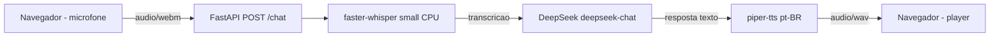
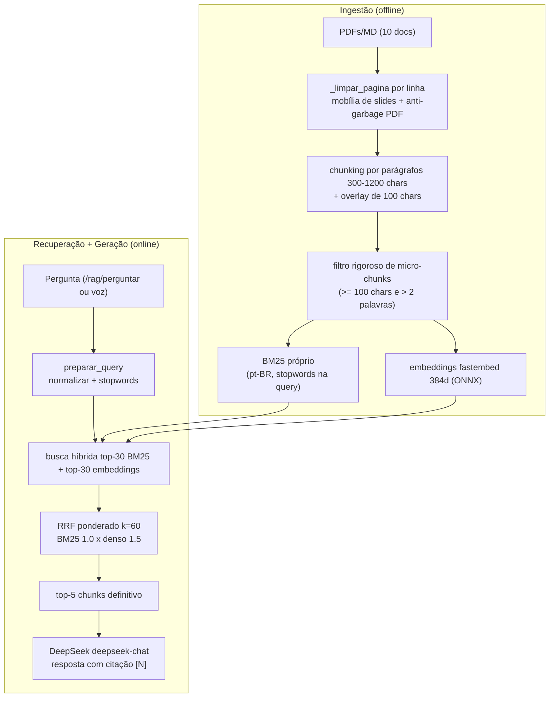

# Projeto Final — Assistente Generativo sobre Materiais do Master IAG & LLM (PUC-Rio)

> **Disciplina:** PROJ · Master IAG & LLM 2025-2 (PUC-Rio)
> **Status:** v0.3 · Imagem ✅ **CONCLUÍDA** (OCR local RapidOCR em 22 figuras; conteúdo da figura no top-5: texto-only 0.000 → texto+imagem 1.000; 3/3 casos em que a visão corrigiu o texto; v0.2 intacta)
> **Repositório base de consulta:** `projeto2/` (protótipo de experimentação)

**Proposta em uma frase:** assistente generativo que responde dúvidas sobre o conteúdo do curso Master IAG & LLM (PUC-Rio), com voz, leitura de imagens e resposta sempre citando a fonte do material — abstendo-se quando a pergunta está fora do corpus.

---

## 1. Objetivo

Construir, **do zero e de forma incremental**, um assistente generativo completo sobre os materiais didáticos do próprio curso. O projeto segue o roadmap oficial da disciplina (v0.1 → v1.0) e cada release é reimplementada, testada manualmente e aprovada antes de avançar para a próxima.

Os objetivos de aprendizado são:

- Implementar um pipeline generativo ponta a ponta: voz → texto → raciocínio → resposta + citação.
- Medir o desempenho de cada etapa com métricas objetivas (WER, recall@k, taxa de abstenção, etc.).
- Experimentar arquiteturas heterogêneas (SLM local + LLM remoto, agentes, RAG multimodal).
- Documentar decisões técnicas e evidências em `docs/`.
- Publicar uma URL pública funcional na v1.0, com estimativa de custo por mil consultas.

---

## 2. Escolha do Tema / Domínio

**Domínio:** materiais didáticos do Master IAG & LLM (PUC-Rio) — ementas, PDFs de aulas, slides e notebooks.

**Por que este domínio atende à especificação:**

- **Corpus acessível e controlado:** os PDFs e slides das disciplinas já estão disponíveis localmente, sem depender de dados de terceiros.
- **Delimitado e mensurável:** perguntas fora do conteúdo do curso são naturalmente identificáveis, facilitando a abstenção correta.
- **Sem PII sensível:** ementas e slides didáticos não carregam dados pessoais (cuidado com fotos ou dados pessoais que eventualmente apareçam — devem ser anonimizados).
- **Cobre todas as releases do roadmap:** voz (aulas gravadas), RAG (PDFs), imagem (slides/figuras), agentes (roteamento de dúvidas), adaptação, avaliação e produção.

> **Corpus inicial (10 documentos):** será montado na preparação inicial (v0.0) em `data/raw/`. Exemplos de documentos: ementas, slides de TDP, NLP, PAI, DPIA, DGL e aulas do próprio projeto.

---

## 3. Especificações por Release

O projeto segue a especificação oficial da disciplina. Cada release adiciona uma capacidade e fecha com evidência medida.

| Release | Capacidade | Entrega esperada | Métrica / evidência |
|---|---|---|---|
| **v0.0** | Fundação | Estrutura de pastas, README, contrato de agentes, `.gitignore`, corpus de 10 docs, ambiente `uv` funcionando. | Repo inicializado, build limpo. |
| **v0.1** | Voz | Protótipo de voz funcional; transcrição com e sem vocabulário de domínio. | WER em 10 amostras próprias, antes/depois do vocabulário. |
| **v0.2** | RAG | Pipeline RAG que responde citando fonte e se abstém fora do corpus. | recall@k + taxa de abstenção correta em golden set. |
| **v0.3** | Imagem | Analisador de imagens integrado ao RAG. | 1 caso documentado em que a visão corrigiu o texto. |
| **v0.4** | Agentes | Fluxo heterogêneo (roteador + modelos distintos), diagrama de chamadas. | Comportamento sob falha documentado + teste. |
| **v0.5** | Adaptação | Tabela comparativa: prompt / RAG / fine-tuning (LoRA) / pré-treino. | Decisão justificada e, se possível, medição. |
| **v0.6** | Avaliação | Relatório de avaliação estratificada. | Desempenho por estrato + 1 falha encontrada pelo aluno. |
| **v1.0** | Produção | URL pública funcionando + README de arquitetura. | Custo por mil consultas estimado. |

Regras de controle:

- Uma release por aula; nunca quebrar uma release já aprovada.
- Cada release fecha com evidência medida registrada em `docs/vXX_*.md`.
- Dependências são adicionadas por release, sem bloat.
- Nunca subir PDFs brutos, `.env`, `.venv` ou caches no Git.

---

## 4. Instruções

### 4.1 Preparação do ambiente

```bash
cd projeto_final

# O projeto já foi inicializado com uv. Crie/ative o ambiente virtual:
uv venv
source .venv/bin/activate

# Sincronize as dependências (inicialmente vazias; por release use uv add):
uv sync
```

### 4.2 Como acompanhar o desenvolvimento release a release

1. **Leia o contrato** em `AGENTS.md` (a ser criado na v0.0).
2. **Verifique o escopo** da próxima release neste README e na spec.
3. **Implemente** a release com testes em `tests/`.
4. **Rode a suite:**
   ```bash
   pytest
   ```
5. **Meça a evidência** e registre em `docs/vXX_*.md`.
6. **Teste manualmente** e peça aprovação ao usuário.
7. **Só então** avance para a próxima release.

### 4.3 Estrutura de pastas

```
projeto_final/
├── README.md            ← este arquivo
├── AGENTS.md            ← contrato permanente para agentes (v0.0)
├── .gitignore
├── pyproject.toml
├── .python-version
├── data/
│   ├── raw/             ← corpus (fora do Git)
│   ├── processed/       ← chunks, índices, modelos (fora do Git)
│   └── golden_set/      ← avaliação reprodutível (no Git)
├── src/
│   └── projeto_final/   ← pacote Python gerado pelo uv
├── tests/               ← testes por release
├── prompts/             ← templates de prompt versionados
└── docs/                ← specs, evidências e relatórios
```

### 4.4 Variáveis de ambiente

Crie um arquivo `.env` (não versionado) para chaves de API:

```bash
DEEPSEEK_API_KEY=sk-...
```

Nunca commitar `.env`.

---

## 5. Arquitetura da v0.1

O prototipo v0.1 segue o pipeline **ASR -&gt; LLM -&gt; TTS**, servido por uma pagina HTML estatica via FastAPI:



Componentes:

- **Entrada:** pagina HTML em `static/index.html` grava audio do microfone e envia via multipart para `/chat`.
- **ASR:** `faster-whisper` small roda 100% em CPU, com vocabulario de dominio como `initial_prompt`.
- **LLM:** DeepSeek `deepseek-chat` via SDK OpenAI, prompt instruindo respostas curtas sem formatacao.
- **TTS:** `piper-tts` com voz `pt_BR-faber-medium`, 100% local.
- **Avaliacao:** 10 amostras de audio proprias em `data/golden_set/voz/`; WER medido antes/depois do vocabulario.

### Resultado da v0.1

| Metrica | Sem vocabulario | Com vocabulario | Ganho |
|---|---|---|---|
| WER medio | 0.2290 | 0.0863 | -0.1427 |
| Acuracia media | 77.10% | 91.37% | +14.27 p.p. |
| Custo por consulta | US$ 0.00 (ASR/TTS local) | US$ 0.00 | - |

Mais detalhes em `docs/v01.md`.

## Arquitetura da v0.2

Pipeline RAG (ingestão offline + recuperação/geração online):



### Resultado da v0.2 (concluída)

**Retrieval isolado** (configuração final — ingestão limpa/anti-garbage, overlay 100,
filtro micro, BM25 próprio, RRF ponderado; sem rerank):

| Metrica | Valor |
|---|---|
| Recall@5 (16 com `docs_esperados`) | **1.000** (16/16) |
| MRR | **0.969** |
| Chunks no corpus | 272 |

**RAG end-to-end** (medição final reexecutada — 272 chunks, `deepseek-chat`, juiz `deepseek-v4-pro`; 20/20 julgadas):

| Metrica | Valor |
|---|---|
| recall@5 (16 com `docs_esperados`) | **1.000** (16/16) |
| Acuracia end-to-end (20) | **0.700** (14/20) |
| Abstencao correta (20) | **0.800** (16/20) |
| Citacao presente (12 nao-abstidas) | 1.000 (12/12) |
| Auditoria de citacao | fiel 10 · fora 2 · fantasma 0 |
| Alucinacoes (juiz) | 0 |
| Custo de embeddings/recuperacao | US$ 0.00 (local) |

> Com o retrieval final (recall@5 1.000), a acurácia end-to-end subiu de 0.550 para
> **0.700** e a abstenção indevida caiu de 0.438 para **0.250** — o gargalo restante é
> a geração (ver `docs/v02.md` §5.4).

Mais detalhes em `docs/v02.md` e `docs/v02_evidencia.md`.

### Resultado da v0.3 (concluída) — Imagem / OCR local integrado ao RAG

A v0.3 extrai as **figuras dos PDFs** (PyMuPDF, dedup por sha1 → 275 imagens
únicas), lê o **texto embutido** com **RapidOCR local (ONNX/CPU)** e indexa as
**22 figuras úteis** no mesmo RAG (corpus 272 → **294 chunks**). O /chat e o
`/rag/perguntar?imagens=true` passam a enxergar o que só existe na figura —
ex.: o slide pede "implemente o **modelo ao lado**", e o modelo está na imagem.

| Metrica (golden set `data/golden_set/imagem/`, 3 perguntas) | Valor |
|---|---|
| Conteudo da figura no top-5 — corpus texto-only (contrafactual) | **0.000** (0/3) |
| Conteudo da figura no top-5 — corpus texto+imagem | **1.000** (3/3) |
| Casos em que a visao (OCR) corrigiu/agregou o texto | **3** |
| Respostas LLM: texto-only absteve / texto+imagem acertou | 3/3 · 3/3 |
| Custo do OCR/figuras | US$ 0.00 (local) |

Mais detalhes em `docs/v03.md` e `docs/v03_evidencia.md`.

---

## 6. Status

| Release | Status |
|---|---|
| v0.0 · Fundação | ✅ Inicializado com `uv init --app`; README, AGENTS.md, estrutura criados. |
| v0.1 · Voz | ✅ WER 0.2290 -> 0.0863; FastAPI + HTML, ASR faster-whisper, LLM DeepSeek, TTS Piper. |
| v0.2 · RAG | ✅ **CONCLUÍDA** — retrieval Recall@5=1.000/MRR=0.969 (272 chunks limpos/anti-garbage); e2e recall@5=1.000/acurácia=0.700 (juiz deepseek-v4-pro); BM25 próprio + RRF ponderado; dataset único do projeto2; rerank testado/desativado. |
| v0.3 · Imagem | ✅ **CONCLUÍDA** — OCR local (RapidOCR/ONNX) de figuras extraídas dos PDFs (PyMuPDF; 275 únicas, 22 úteis indexadas); corpus texto+imagem 294 chunks; conteúdo da figura no top-5: 0.000 (texto) → 1.000 (texto+imagem); 3/3 casos em que a visão corrigiu o texto; `/rag/perguntar?imagens=true`, `/rag/imagem/analisar`. |
| v0.4 · Agentes | ⏳ |
| v0.5 · Adaptação | ⏳ |
| v0.6 · Avaliação | ⏳ |
| v1.0 · Produção | ⏳ |

---

## 7. Referências

- **Protótipo de consulta:** `../projeto2/` — contém as decisões técnicas e evidências das releases anteriores.
- **Spec oficial da disciplina:** `../projeto2/docs/spec_projeto_final.md`.
- **Notas de planejamento:** `../TODO.md` (workspace).
