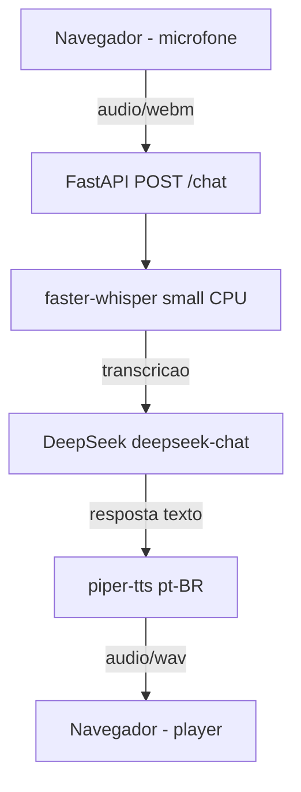

# v0.1 — Voz

> Protótipo funcional de chat por voz: página HTML estática servida pelo FastAPI,
> pipeline ASR → LLM → TTS e avaliação de WER em 10 amostras próprias.

---

## 1. Evidências

### 1.1 Resumo do WER

- **Frases avaliadas:** 10
- **Backend:** faster-whisper local (CPU) (modelo 'small')
- **Custo:** US$ 0.00 (100% local)
- **WER medio sem vocabulario:** 0.2290
- **WER medio com vocabulario:** 0.0863
- **Ganho absoluto:** +0.1427

| frase | audio | WER sem | WER com |
|---|---|---|---|
| 1 | 01.ogg | 0.2222 | 0.0000 |
| 2 | 02.ogg | 0.3333 | 0.1667 |
| 3 | 03.ogg | 0.1667 | 0.0000 |
| 4 | 04.ogg | 0.0000 | 0.0000 |
| 5 | 05.ogg | 0.3750 | 0.1250 |
| 6 | 06.ogg | 0.1000 | 0.0000 |
| 7 | 07.ogg | 0.8571 | 0.5714 |
| 8 | 08.ogg | 0.1250 | 0.0000 |
| 9 | 09.ogg | 0.0000 | 0.0000 |
| 10 | 10.ogg | 0.1111 | 0.0000 |

## Pipeline v0.1



## Conclusoes

- O vocabulario de dominio reduziu o WER medio de 0.2290 para 0.0863 (ganho absoluto de 0.1427).
- A acuracia media subiu de 77.10% para 91.37% (+14.27 pontos percentuais).
- 7 das 10 frases atingiram WER 0.0000 com o vocabulario.
- A frase 7 ("Agentes multimodais combinam texto, imagem e audio") permaneceu como o caso mais desafiador, com WER 0.5714 mesmo com vocabulario.
- Todo o pipeline ASR/TTS e local (custo zero); apenas o LLM DeepSeek consome API.

---

## 2. Plano de execução

### 2.1 Objetivo da release

Entregar um **protótipo funcional de chat por voz** acessível via navegador:

1. Página HTML estática servida pelo FastAPI com gravação de áudio pelo microfone.
2. Endpoint `/chat` que recebe o áudio e executa o pipeline:
   - ASR: `faster-whisper` small com e sem prompt de vocabulário de domínio.
   - LLM: DeepSeek (via SDK OpenAI) para gerar a resposta textual.
   - TTS: `piper-tts` local para sintetizar a resposta em áudio.
3. Avaliação de WER em 10 amostras próprias, comparando transcrição **sem** e **com** vocabulário.
4. Logs de debug em todas as etapas usando `loguru`.

### 2.2 Escopo

- [x] Reimplementar do zero (consultando `projeto2/` como referência, sem copiar código diretamente).
- [x] Entrega da v0.1: página funcional + endpoint + avaliação WER + documentação.
- [x] Não incluir RAG (v0.2), visão (v0.3) nem agentes (v0.4).
- [x] Resposta do LLM pode ser genérica sobre o domínio do curso; não é necessário citar fonte ainda.

### 2.3 Dependências

- [x] `faster-whisper>=1.1` — ASR local (CPU).
- [x] `piper-tts>=1.2` — TTS local em pt-BR.
- [x] `python-multipart>=0.0.9` — upload de arquivo no endpoint `/chat`.
- [x] `fastapi>=0.115` — framework da API.
- [x] `uvicorn>=0.30` — servidor ASGI.
- [x] `openai>=1.40` — SDK compatível com DeepSeek.
- [x] `loguru>=0.7` — logging estruturado em todas as etapas.
- [x] `pytest>=8.0` — testes.

### 2.4 Estrutura de arquivos

```
projeto_final/
├── src/
│   └── projeto_final/
│       ├── __init__.py
│       ├── main.py              # FastAPI: serve HTML e endpoint /chat
│       ├── voz.py               # transcrição com faster-whisper + vocabulário
│       ├── tts.py               # síntese com piper-tts
│       ├── llm.py               # cliente DeepSeek via openai
│       ├── config.py            # carrega .env e expõe constantes
│       └── wer.py               # cálculo de WER
├── scripts/avaliadores/
│   └── avaliar_v1.py            # script de avaliação WER (v0.1)
├── prompts/
│   └── v0.1/
│       └── vocabulario_voz.txt  # termos do domínio como prompt-guia
├── data/
│   ├── raw/                     # não versionado
│   ├── processed/               # não versionado
│   └── golden_set/
│       └── voz/
│           ├── referencias.json # 10 frases de referência
│           └── 01.ogg ... 10.ogg # 10 amostras de áudio próprias
├── tests/
│   └── test_v01.py              # testes da v0.1
├── docs/
│   ├── v01.md                   ← este arquivo
│   └── v01_voz_evidencia.md    # evidência medida
└── static/
    └── index.html               # página estática do chat por voz
```

### 2.5 Pipeline do endpoint `/chat`

1. [x] Recebe `POST /chat` com `multipart/form-data` contendo o arquivo de áudio.
2. [x] Salva o áudio temporariamente e transcreve com `faster-whisper` small usando vocabulário de domínio.
3. [x] Envia o texto transcrito para DeepSeek com um prompt simples de assistente do curso.
4. [x] Sintetiza a resposta com `piper-tts` para um arquivo `.wav`.
5. [x] Retorna o áudio `.wav` com headers customizados:
   - `X-Transcription`: texto transcrito.
   - `X-Answer`: resposta textual do LLM.
6. [x] Todos os passos logados com `loguru` (debug).

### 2.6 Página HTML (`static/index.html`)

- [x] Gravação de áudio pelo microfone e envio para `/chat`.
- [x] Mensagens novas aparecem no **início** da lista.
- [x] Botões desativados durante o envio.
- [x] Timer na mensagem de status enquanto aguarda resposta.
- [x] Player de áudio reproduz a resposta do assistente.
- [x] Card da v0.1 com tabela de WER e destaques dos resultados.

### 2.7 Avaliação WER

- [x] 10 frases de referência sobre o domínio do curso em `data/golden_set/voz/referencias.json`.
- [x] 10 arquivos de áudio correspondentes (`01.ogg` … `10.ogg`).
- [x] Script `scripts/avaliadores/avaliar_v1.py` mede WER sem/com vocabulário.
- [x] Página `static/index.html` atualizada com os valores medidos.
- [x] Evidência documentada na seção 1 deste arquivo.

### 2.8 Testes

- [x] `tests/test_v01.py`:
  - Verifica normalização e WER.
  - Verifica se o endpoint `/` serve o `index.html`.
  - Verifica `/saude`.
  - Verifica `/chat` com áudio de teste.

### 2.9 Critérios de aprovação

- [x] `uv sync` instala todas as dependências sem erro.
- [x] `pytest` passa.
- [x] Servidor sobe com `uvicorn projeto_final.main:app --reload`.
- [x] Página carrega em `/` e consegue gravar/enviar áudio.
- [x] Endpoint `/chat` devolve áudio `.wav` reproduzível.
- [x] WER medido em 10 amostras; comparação sem/com vocabulário documentada.
- [x] Evidência registrada na documentação da v0.1.
- [x] Commit `v0.1` feito.

---

## 3. Instruções de execução

```bash
cd projeto_final
source .venv/bin/activate

# Rodar testes
pytest

# Iniciar servidor
uvicorn projeto_final.main:app --host 127.0.0.1 --port 8000

# Rodar avaliação WER (para regenerar evidências e tabela)
python scripts/avaliadores/avaliar_v1.py
```

Acesse a aplicação em: http://127.0.0.1:8000/

---

## 4. Referências internas

- `../projeto2/` — protótipo de consulta para decisões técnicas.
- `../README.md` — objetivo, especificações e status do projeto.
