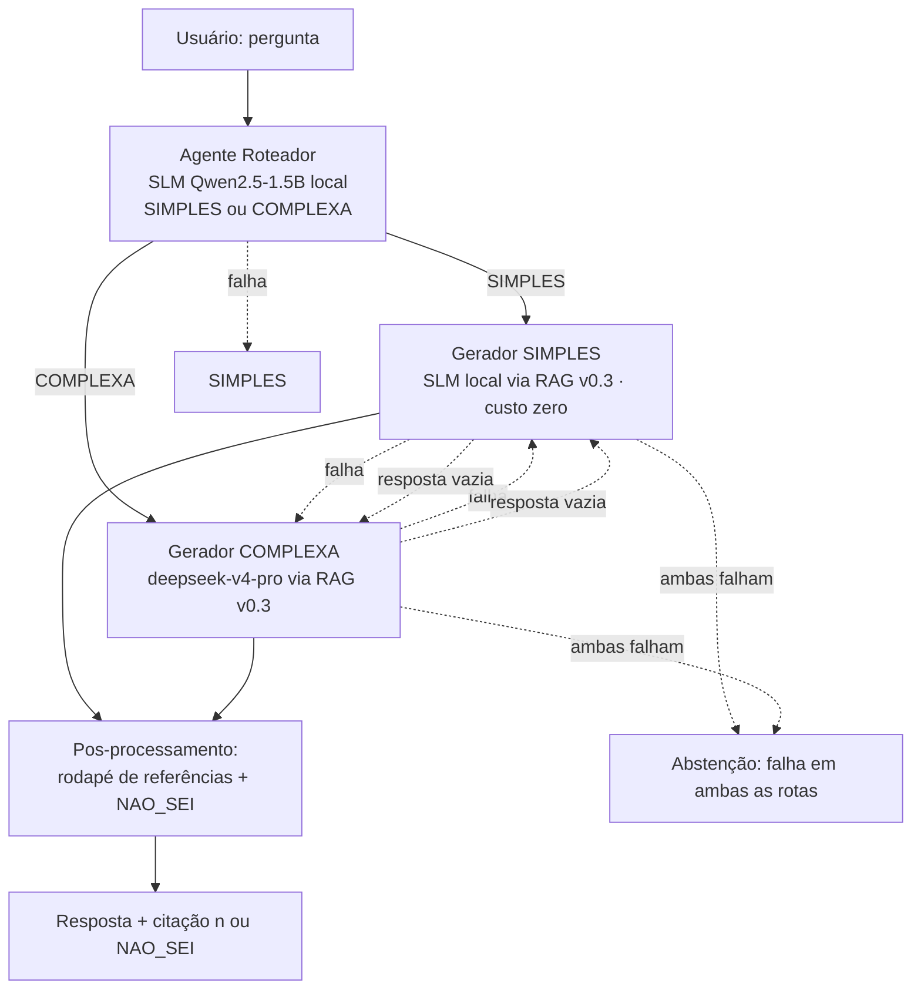

# v0.4 · Agentes — fluxo heterogêneo (roteador SIMPLES/COMPLEXA + SLM local + LLM remoto)

> Release da Aula 04. Requisito da spec: **fluxo heterogêneo ponta a ponta**,
> com **diagrama de chamadas** e **comportamento documentado sob falha**.
> Evidência medida em `docs/v04_evidencia.md`.

## 1. Requisito e leitura

A spec pede um sistema com **múltiplos papéis** (roteador + geradores) operando
de forma **heterogênea**: um **SLM local de verdade** (adequado à rota simples,
custo zero) e um **LLM remoto maior** (rota complexa), com fallback cruzado sob
falha. O projeto_final reimplementou do zero as decisões validadas na tag v0.4
do `projeto2`, **reutilizando o índice RAG v0.3 existente** (294 chunks:
272 texto + 22 imagem) — não recria retrieval.

## 2. O SLM desta v0.4 é um SLM de verdade

A rota simples usa **Qwen2.5-1.5B-Instruct** (GGUF Q4_K_M, ~1,1 GB) rodando
**100% local em CPU** via `llama-cpp-python` — não um modelo grande "servido
como flash". Terminologia alinhada à definição operacional da aula (adequação ao
papel, custo e infraestrutura). Compilado do sdist no Python 3.14; GGUF fica em
`data/processed/slm_models/` (fora do Git).

## 3. Papéis e mapeamento de modelos (parametrizáveis)

| Papel | Padrão | Opções | Modelo (mapeado) |
|---|---|---|---|
| Roteador | `cascade` | `slm`, `flash`, `tfidf`, `cascade` | R2 (TF-IDF char_wb+XGB) decide; `INDETERMINADO` → R1 slm (§11) |
| Gerador simples | `slm` | `slm`, `flash`, `pro` | Qwen2.5-1.5B local (US$ 0.00) |
| Gerador complexa | `pro` | `slm`, `flash`, `pro` | `deepseek-v4-pro` (API) |

**Mapeamento:** `flash → deepseek-v4-flash` (config.AGENTE_MODELO_FLASH) e
`pro → deepseek-v4-pro` (config.AGENTE_MODELO_PRO; o `pro` já era usado na v0.3
como juiz). Os defaults são **independentes** de `DEEPSEEK_MODEL`/`JUIZ_MODEL` e
sobrescrevíveis por env (`AGENTE_MODELO_FLASH`/`AGENTE_MODELO_PRO`). Quando uma
função nova da v0.4 usa `flash`, ela passa o modelo mapeado **explicitamente** na
chamada (`llm.completar`/`responder_com_contexto` com
`modelo=config.AGENTE_MODELO_FLASH`). Tudo escolhível por env
(`AGENTE_ROTEADOR/SIMPLES/COMPLEXA`, `SLM_*`) ou CLI
(`python -m projeto_final.agentes perguntar ... --roteador ... --simples ... --complexa ...`).
**Default da v0.4 (após o estudo do roteador, §11): `cascade` com θ=0.60** —
o R2 (TF-IDF+XGB, <2 ms, US$ 0) decide as perguntas confiantes e só as de baixa
margem (`INDETERMINADO`) sobem ao R1 (SLM few-shot). `AGENTE_ROTEADOR=slm`
restaura o R1 como roteador único.

## 4. O agente roteador (SIMPLES/COMPLEXA)

O roteador é a "triagem" do sistema: recebe a **pergunta do usuário** e decide, em
**uma chamada curta e sem RAG**, se ela vai para a rota **SIMPLES** (uma fonte
basta) ou **COMPLEXA** (composta/comparativa/ambígua/multifonte). Implementação:
`agentes.classificar_rota()` usando o prompt `prompts/v0.4/roteador_sistema.txt`
(definição das classes + **exemplos few-shot em pt-BR**).

> **Nota (default v0.4):** após o estudo do roteador (§11), o default é o
> **`cascade`** (R2 TF-IDF+XGB decide; `INDETERMINADO` → R1 `slm`, θ=0.60).
> Esta seção detalha os roteadores **R1 (`slm`)** e **API (`flash`)** que compõem
> o sistema/estudo; o R2 é detalhado em §11.

**Contrato da saída:** a resposta deve conter `SIMPLES` ou `COMPLEXA`; o parser é
tolerante (qualquer ocorrência de `COMPLEXA` → rota complexa; senão → simples) e
o `temperature=0.0` garante decisão determinística (sem custo de "pensar de novo").

### 4.1 Variação do roteador: R1 `slm` (local) × R1 API `flash`

| | **Roteador `slm`** (padrão) | **Roteador `flash`** |
|---|---|---|
| Modelo | Qwen2.5-1.5B-Instruct (GGUF Q4_K_M, local) | `deepseek-v4-flash` (`AGENTE_MODELO_FLASH`) |
| Custo | **US$ 0.00** (100% local) | pago (chamada curta: `max_tokens=100`) |
| Latência | ~2–13 s (1ª chamada carrega o GGUF) | ~3–7 s (API) |
| Dependências | GGUF em `data/processed/slm_models/` + CPU | chave DeepSeek disponível |
| Config | `AGENTE_ROTEADOR=slm` | `AGENTE_ROTEADOR=flash` |
| Quando usar | default local/CLI; rodadas de avaliação | API pública (Space 2 vCPU); orçamento de latência; SLM indisponível |

A seleção é por **env** (`AGENTE_ROTEADOR`) ou **CLI**
(`--roteador slm|flash` em `perguntar`/`avaliar`). Quando a função `classificar_rota`
usa `flash`, ela chama `llm.completar(modelo=config.AGENTE_MODELO_FLASH)` —
o modelo mapeado é passado **explicitamente** (nada de hardcode nem substituição
silenciosa). No Space público o secret `AGENTE_ROTEADOR=flash` mantém o chat
responsivo; localmente o default `slm` roda a classificação a custo zero.

### 4.2 Engenharia de prompt para o SLM pequeno (few-shot)

Medição honesta: o **Qwen 1.5B sem exemplos classificava 19/20 perguntas como
COMPLEXA** (viés do modelo pequeno — sem contra-exemplos, ele adere à definição
"ampla" da classe complexa). Correção com **few-shot pt-BR no system** (exemplos
positivos de SIMPLES *e* de COMPLEXA alinhados ao vocabulário do curso) →
distribuição **13 simples / 7 complexas** no golden set, coerente com os estratos
das perguntas. Esta é a técnica que **mais impactou a qualidade do roteador**.

### 4.3 Segurança sob falha

Qualquer falha do roteador (GGUF ausente, API fora do ar, timeout, resposta
inesperada) → **assume SIMPLES e segue** (rota barata/robusta). A pergunta nunca
é perdida por causa do roteador; o cenário está coberto por testes com mock
(`test_roteador_slm_falha_assume_simples` e `test_roteador_flash_falha_assume_simples`).

## 5. Otimizações e técnicas aplicadas ao SLM

### 5.1 Modelo e quantização

- **Qwen2.5-1.5B-Instruct em GGUF Q4_K_M** (~1,1 GB, ~4,5 bits por peso): o
  equilíbrio medido entre qualidade e tamanho para rodar **100% em CPU** (não é
  um modelo grande "servido como flash").
- Runtime **`llama-cpp-python` 0.3.35** compilado do sdist (source-only) no
  **Python 3.14** com a toolchain local (cmake + gcc/g++).

### 5.2 Build e empacotamento (portabilidade/deploy)

- **`CMAKE_ARGS=-DGGML_NATIVE=OFF`**: impede o `-march=native` do host →
  binário **portável x86-64**. Sem isso, o GGUF carregava com instruções do CPU
  local e o container do Space morria com **SIGILL (exit 132)**.
- **Paralelismo de build limitado (`-j2`)** via
  `CMAKE_BUILD_PARALLEL_LEVEL/MAX_JOBS/MAKEFLAGS`: compilar o llama.cpp com todos
  os núcleos estourava a memória do build do HF (**OOMKilled, exit 137**).
- **GGUF fora do Git**: fica em `data/processed/slm_models/` (gitignored) e é
  entregue ao container via **dataset privado** (upload de `processed/slm_models/*`
  + `allow_patterns` no entrypoint) — o repositório/Space público não carrega o
  modelo de 1,1 GB.

### 5.3 Runtime: carregamento e ciclo de vida

- **Lazy-load + singleton**: `slm._get_llm()` só instancia o `Llama` na primeira
  chamada que de fato precisa do SLM (roteador local ou rota simples). O boot dos
  fluxos `/chat` que usam flash/pro **não** paga a carga de ~1,1 GB.
- **Fechamento explícito no exit** (`atexit` → `_llm.close()`): fecha o modelo
  enquanto os módulos ainda estão vivos e elimina o erro benigno do
  `Llama.__del__` no shutdown do Python 3.14.
- **Contexto `n_ctx=4096`** (`SLM_N_CTX`): comporta o prompt + 5 chunks do RAG;
  **`n_threads=8`** (`SLM_N_THREADS`) aproveita os núcleos da CPU local.

### 5.4 Decoding e prompts específicos do tamanho

- **Roteador**: `max_tokens=16`, `temperature=0.0` — resposta de 1 palavra,
  determinística, sem gastar tokens pensando.
- **Gerador (rota simples)**: `max_tokens=400` (`SLM_MAX_TOKENS`),
  `temperature=0.2` — respostas objetivas com leve variação natural;
  `prompts/v0.4/rag_sistema_slm.txt` enxuto: só o contexto, `NAO_SEI` isolado,
  citar `[N]` — **prompt curto funciona melhor no 1.5B** do que regras longas.
- **Adequação ao papel (definição operacional da aula)**: o SLM só executa o que
  cabe no seu tamanho — **classificar com exemplos** e **responder curto com
  contexto**. Tarefas de raciocínio longo/comparativo vão para a rota complexa
  (pro) por decisão do roteador, não por capacidade do SLM.
- **Few-shot no roteador** (detalhe em §4.2) foi a técnica de prompt de maior
  impacto: 19/20 COMPLEXA → **13 simples / 7 complexas**.

### 5.5 Robustez e honestidade

- Falha do SLM **não derruba a pergunta**: exceção/resposta vazia no gerador
  simples → **fallback para pro**; GGUF ausente → `FileNotFoundError` com a
  instrução de download (tratado pelo orquestrador como falha de rota).
- Trade-off **custo × latência documentado** (§10): 40–140 s por geração em CPU
  (8 núcleos). No Space público (2 vCPU) a rota simples síncrona levaria minutos
  — por isso o deploy usa roteador/geradores `flash`, mantendo o SLM local para
  ambiente local/CLI e avaliação.

## 6. Diagrama de chamadas




Fluxo: (1) roteador classifica com 1 chamada curta (SLM local, `temperature=0`,
max 16 tokens); (2) o gerador da rota recupera **top-5 no corpus v0.3** e monta o
contexto com o mesmo `_formatar_contexto` do pipeline v0.3; (3) o modelo da rota
gera a resposta; (4) `_formatar_referencias` renumera `[N]` e monta o rodapé
(anti-alucinação) — **mesma saída** do RAG v0.3 (`resposta`, `resposta_tts`,
`referencias`), agora com `rota`/`agente`/`fallback` para auditoria.

## 7. Integração com a API

- **`/chat` (voz) e `/chat/imagem` usam o fluxo multiagente por padrão**
  (`AGENTES_HABILITADO=true`): o `_pipeline_resposta` (compartilhado pelos dois
  fluxos) chama `agentes.responder_agentes` — roteador + geradores com fallback
  no corpus texto+imagem (v0.3) — e o resultado segue para o TTS com o mesmo
  contrato (`audio/wav` + `X-Transcription`/`X-Answer`). Desligue com
  `AGENTES_HABILITADO=false` (volta ao `responder_v3` de modelo único).
- **Endpoints JSON removidos na v0.4**: `/rag/perguntar` e `/rag/imagem/analisar`
  **não eram usados pelo `index.html`** (o front-end só chama `/chat` e
  `/chat/imagem`) e foram removidos; `/rag/saude` (healthcheck) permanece.
- Rate limit: `/chat` e `/chat/imagem` continuam no grupo `rag` (4/min).
- CLI: `python -m projeto_final.agentes perguntar "pergunta"` e `... avaliar`.
- **No Space público** (hardware `cpu-upgrade`, 2 vCPU) os secrets definem
  `AGENTE_ROTEADOR=flash` / `AGENTE_SIMPLES=flash` / `AGENTE_COMPLEXA=pro`: a
  rota SLM síncrona levaria minutos em 2 vCPU e estouraria o gateway; o SLM
  local fica para uso **local/CLI** (padrão do código). O `llama-cpp-python` do
  container é compilado portável (`GGML_NATIVE=OFF` — sem o SIGILL/exit 132 do
  `-march=native` do host).

## 8. Comportamento sob falha (documentado e testado)

| Falha | Comportamento |
|---|---|
| Roteador (SLM ou flash) indisponível/falha | assume **SIMPLES** e segue |
| Gerador da rota escolhida lança exceção | **fallback** para o gerador da outra rota |
| Gerador responde vazio | tratado como falha → **fallback** |
| Gerador complexa (pro) falha | fallback para simples |
| Gerador simples (SLM) falha | fallback para complexa |
| **Ambas as rotas falham** | **abstenção** (`NAO_SEI`) com `motivo="falha em ambas as rotas"` e `erros[]` |

6 cenários cobertos em `tests/test_v04.py` com `unittest.mock` (sem API/LLM/GGUF),
mais o smoke test do SLM com `skipif` quando o GGUF não está baixado.

## 9. Dataset de avaliação e processo

- **Dataset único:** `data/golden_set/rag/perguntas.json` — as mesmas 20
  perguntas das releases RAG (16 respondem, 4 adversariais `deve_abster=true`),
  **inalterado** (regra: um dataset por release; v0.4 reavalia este).
- **Processo:** `avaliar_v4.py` roda `agentes.avaliar_golden` no corpus v0.3:
  por pergunta, o orquestrador roteia e gera; o avaliador mede se
  `abstencao == deve_abster`, registra rota/agente/fallback/latência/tokens.
- **Reproduzir:**
  ```bash
  python scripts/avaliadores/avaliar_v4.py
  python scripts/avaliadores/avaliar_v4.py --roteador flash   # roteador remoto
  pytest                                                       # suíte completa
  ```

## 10. Resultados

> Rodada abaixo: medição **R1/SLM** (0.950) — arquitetura multiagente original.
> Após o **estudo do roteador (§11)**, o default passou a `cascade`@0.60; o E2E
> do default mede **0.850** (erros #12/#13/#15, decisão por custo/latência).

Rodada final medida em `docs/v04_evidencia.md` (golden set de 20, `avaliar_v4.py`):

| Métrica | Valor |
|---|---|
| **Abstenção correta (20)** | **0.950** (19/20) |
| Rotas | 13 simples (SLM local) + 7 complexas (pro) |
| Agentes | gerador-slm 13 · gerador-pro 7 |
| Fallbacks | **0** (nenhuma falha na rodada final) |
| Latência média | **64.96 s** (simples ~40–140 s CPU; complexas ~9–28 s API) |
| Tokens API (rotas pagas) | prompt 10 003 · completion 3 650 |
| Custo das rotas simples | **US$ 0.00** (local) |

Único erro (#12, "diferença entre prompt engineering e fine-tuning"): o `pro`
**absteve-se (`NAO_SEI`) mesmo com fontes** — abstenção indevida 0.05. As 4
perguntas adversariais abstiveram 4/4, e as demais 15 com fonte responderam 15/15.

**Ajuste documentado (engenharia de prompt para SLM):** o roteador Qwen 1.5B sem
few-shot tende a classificar tudo como COMPLEXA; com `prompts/v0.4/roteador_sistema.txt`
(few-shot pt-BR) a distribuição ficou **13 simples / 7 complexas**, coerente com
os estratos do golden set.

**Ajuste de orçamento (raciocínio do pro):** na 1ª rodada, 4 chamadas do
`deepseek-v4-pro` voltaram **vazias** (`finish_reason='length'` — raciocínio
consumindo o `max_tokens=400`). Com `AGENTE_PRO_MAX_TOKENS=1500` as 7 rotas
complexas responderam (0 fallbacks na rodada final).

**Trade-off custo × latência assumido:** a rota simples troca custo (US$ 0.00)
por latência (~40–140 s por pergunta em CPU); a rota complexa paga API (~10–25 s).
Na v1.0, o caminho de produção pode escolher SLM quando o orçamento de latência
permitir (o roteador é parametrizável por env/CLI).

## 11. Estudo do roteador (R1 × R2 × R3) — decisão por custo/latência

> Estudo controlado realizado na v0.4 para escolher o roteador padrão. Dataset do
> estudo é artefato de experimento (`data/processed/rag_v4/roteador_rotulos.json`,
> gerado por `scripts/avaliadores/gerar_dataset_roteador.py`) — **não** é golden
> set (o único da release segue sendo `perguntas.json`).

### 11.1 Referência do protótipo (projeto2)

**v0.4 (projeto2) — roteador SLM local few-shot:** zero-shot Qwen2.5-1.5B
classificava **19/20 como COMPLEXA** (viés do modelo pequeno); few-shot no prompt
→ **13 SIMPLES / 7 COMPLEXAS**; end-to-end **abstenção correta 0.95**, 0
fallbacks, US$ 0.00 nas rotas simples, SLM ≈ 37,5 s vs API ≈ 12,1 s.

**v1.0 (projeto2) — jornada de 8 classificadores (holdout 164 itens):**

| classificador | acurácia | falso-SIMPLES | memória | latência |
|---|---|---|---|---|
| **char_wb (TF-IDF 3-5) + XGBoost** | **0.945** | 4 | ~10 MB | <1 ms |
| cascata heur + char_wb | 0.945 | 1 | ~10 MB | <1 ms |
| cascata heur + BERTimbau | 0.963 | 1 | 1.5 GB | 85 ms |
| BERTimbau + XGBoost | 0.835 | 25 | 1.5 GB | 84 ms |
| MiniLM-multilíngue + LogReg | 0.829 | 20 | ~100 MB | 5 ms |
| heurístico (regex) | 0.811 | 28 | 0 | 0 |
| routellm/bert (zero-shot) | 0.746 | 9 | 1.3 GB | 30 ms |
| kNN (MiniLM) | 0.730 | 8 | ~100 MB | 5 ms |
| DeepSeek flash (API) | 0.650 | — | 0 | ~1 s |

Vencedor do projeto2: `TfidfVectorizer(analyzer='char_wb', ngram_range=(3,5),
max_features≈1000)` + XGBoost — **imune a typos** de ASR e sem torch no
roteador. Motivações: robustez a typos da transcrição de voz; tirar torch/llama
do roteamento.

### 11.2 Dataset e processo (projeto_final)

- 20 perguntas do `perguntas.json` rotuladas (código em
  `src/projeto_final/roteador_tfidf.py::ROTULOS`) → **13 SIMPLES / 7 COMPLEXAS**
  (mesmo critério do prompt do roteador);
- **14 variações com typo** (sem acentos, "para"→"pra", queda/troca de letra)
  simulando ASR — determinísticas;
- avaliação isolada: `scripts/avaliadores/avaliar_roteador.py` (armazena
  predições e varre o limiar da cascata **sem** chamadas extras ao SLM/API);
- end-to-end no golden set (20) com os mesmos geradores `slm`/`pro`.

### 11.3 Roteador isolado (34 itens: 20 canônicas + 14 typos)

| Backend | Acc canônicas | Acc typos | Acc total | Falso-SIMPLES | Latência mediana | Memória |
|---|---|---|---|---|---|---|
| **slm (R1)** | 0.900 | 0.929 | 0.912 | 1 | 5.72 s | 1.12 GB (GGUF) |
| **tfidf (R2)** | 1.000\* | 0.857 | 0.941 | 2 | 0.0015 s | ~124 KB |
| flash (API) | 0.700 | 0.714 | 0.706 | 10 | 1.28 s | 0 |
| **cascade (R3)** | 1.000 | 0.929 | **0.971** | **1** | **0.84 s (mix)** | só ~15% escala ao SLM |

\* in-sample (R2 é treinado nas 20). CV estratificada (5 folds) do R2: **0.600**
(7 falso-SIMPLES) — com n=20 a generalização do clássico é fraca.

**Varredura do limiar da cascata (R2 decide; `INDETERMINADO` → R1 slm):**

| θ | Acc canônicas | Acc typos | Falso-S | Escala % | Lat mix média |
|---|---|---|---|---|---|
| **0.60** | **1.000** | **0.929** | **1** | 14.7 | **0.84 s** |
| 0.65 / 0.70 | 0.950 | 0.929 | 2 | 20.6 | 1.18 s |
| 0.75 / 0.80 | 0.950 | 0.929 | 2 | 29.4 | 1.68 s |

Ponto ótimo: **θ=0.60** — iguala/acerta a classificação do R1 (falso-SIMPLES 1)
escalando só ~15% das perguntas ao SLM (~7× mais rápido no mix).

### 11.4 End-to-end no golden set (20) — medições reais

| Roteador | Abstenção correta | Rotas | Agentes | Fallbacks | Latência média |
|---|---|---|---|---|---|
| **R1 slm** (evidência v0.4) | **0.950** | 13/7 | slm 13 · pro 7 | 0 | 64.96 s |
| **R2 tfidf** | 0.850 | 13/7 | slm 13 · pro 7 | 0 | 62.46 s |
| **R3 cascade θ=0.60** (default) | **0.850** | 13/7 | slm 13 · pro 7 | 0 | 66.16 s |

Erros do R3 (e do R2): **#12** (o `pro` abstém mesmo com fontes — erro herdado do
R1) e **#13/#15**: a cascata roteia com confiança conforme os **rótulos do estudo**
(#13→complexa, #15→simples), mas sob o R1 essas duas perguntas eram respondidas
**corretamente nas rotas opostas** — o `INDETERMINADO` (θ=0.60) **não** captura
itens com margem alta, então o desalinhamento "rótulo de complexidade × rota que
o gerador responde melhor" custa 2 acertos.

### 11.5 Decisão registrada

Aplicando a regra da §7 (não perder >1 acerto no E2E), R1 venceria. **Decisão da
v0.4 (por custo/latência, aprovada): default = `cascade` com θ=0.60** — o R2
decide ~85% das perguntas a **<2 ms / US$ 0.00** e só ~15% (`INDETERMINADO`)
sobem ao SLM (~7× mais rápido no mix do roteador); aceita-se a abstenção correta
**0.850** no golden set (vs 0.950 do R1 puro). Para reverter:
`AGENTE_ROTEADOR=slm`. Backends disponíveis: `slm`, `flash`, `tfidf`, `cascade`.

**Recomendações (documentadas, sem mudar a decisão):** com um dataset rotulado
maior (ex.: o caminho de 164 itens do projeto2), R2/cascade tendem a superar o
SLM (no projeto2: 0.945, <1 ms); treinar os rótulos a partir das **decisões do
R1** (destilação) elimina o desalinhamento #13/#15; e a CV 0.60 do R2 com n=20
mostra o limite de generalizar com 20 exemplos.


